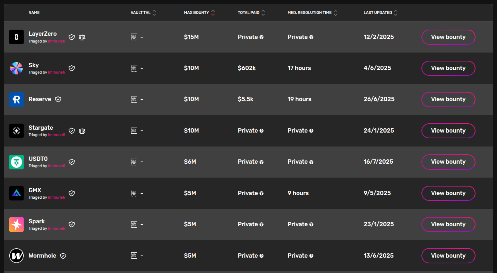
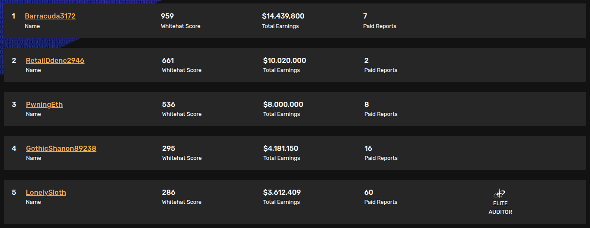

# کانتست یا باگ بانتی؟

یکی از سوالاتی که برای محققین امنیت بلاکچین یا وب ۳ پیش میاد اینه که **کانتست بهتره یا باگ بانتی؟**، در نتیجه تصمیم گرفتم تا یک مطلب نسبتا کامل راجب این دو تا موضوع، تفاوت هاشون و اینکه هرکدوم مناسب چه افرادی هستش توضیح بدم.

## چرخه ی امنیت یک پروتکل

چرخه یا سایکل بلوغ امنیتی یک پروتکل عمدتا به شکل زیر هستش:
- توسعه
- آدیت اولیه یا Internal Audit
    - این مرحله عموما توسط توسعه دهنده های خود پروتکل انجام میشه تا آسیب پذیری ها و اشکالات ابتدایی پروتکل پیدا و رفع بشن که این کار هم به صورت دستی و با نوشتن تست ها انجام میشه، هم با استفاده از ابزارهایی مثل Slither و هم اگر پروتکل ها بزرگ تر و درست و حسابی تر باشن شاید یک تیم امنیت متشکل از یک سری آدیتور داشته باشن که اونها هم یه آدیت دستی روی پروتکل انجام بدن
- آدیت ثانویه یا Private Audit
    - این مرحله توسط یک فرد یا تیم و یا یک شرکت خارجی انجام میشه که بهش Private Audit هم گفته میشه. 
-  بازنگری یا Mitigation Review
    - بعد از انجام Private Audit و ارایه گزارش آدیت توسط پیمانکار، کارفرما اقدام به رفع باگ های پیدا شده میکنه و مجددا پیمانکار یک بازنگری روی پروتکل انجام میده تا مطمئن بشه که رفع باگ های قبلی منجر به ایجاد باگ های جدید نشده باشه.
- برگزاری کانتست 
    - در این مرحله پروتکل ها از طریق پلتفرم های برگزار کننده کانتست اقدام به برگزاری کانتست میکنن تا بعد از یک بررسی جمعی یا Crowdsource Review مطمئن بشن که تقریبا تمامی باگ های ممکن کشف و رفع شده و دیگه پروتکل آماده Launch شدن هستش.
- باگ بانتی
    - بعد از اینکه پروتکل Launch شد و دیگه واقعا تریدر ها و سایر بازیگران اصلی این حوزه پول هاشون رو ریختن داخل پروتکل، اگر باگی پیدا بشه که در طول مراحل قبلی کشف نشده باشه منجر به یک فاجعه خواهد شد، چون دیگه بحث فرضیات نیست، این پول واقعیه مردمه که از بین میره، به همین دلیل پروتکل ها از طریق پلتفرم های باگ بانتی مثل Immunefi اقدام به برگزاری یک BBP یا Bug Bounty Program میکنن تا اگر باگی بعد از اجرای پروتکل پیدا شد، اون یابنده ی باگ از طریق این پلتفرم ها باگ رو گزارش کنه و در ازای این کارش اون پروتکل هم یک مبلغ از پیش تعیین شده ای رو به اون یابنده باگ تقدیم کنه.

این تقریبا کامل ترین چرخه ی بلوغ امنیتی یک پروتکل هستش که خب با توجه به عدم وجود یک استاندارد مشخص در این حوزه، پروتکل ها کاملا سلیقه ای عمل میکنن و امکان داره بنا به صلاح دید خودشون هرکدوم از مراحل بالا رو حذف کنن، یا اصلا کلا هیچ کدوم از مراحل بالا رو انجام ندن و امنیت براشون اصلا مهم نباشه که خب موضوع بحث ما این نیست.

حالا که کاملا نقش کانتست و باگ بانتی در این فرآیند رو متوجه شدیم در ادامه به بررسی هر یک خواهیم پرداخت.

## کانتست | Contest
کانتست آدیت یا ‌Audit Contest در واقع یک Crowd Source Review یا بررسی جمع سپاری شده هستش که طی این فرآیند تعداد زیادی متخصص امنیت با تخصص ها و سطوح مختلف در این رقابت شرکت میکنن، باگ هارو کشف و ریپورت میکنن و پول میگیرن.

در این رقابت پلتفرم ها به تعداد باگ هایی که کشف میکنید، میزان حیاتی بودنشون وهمینطور Unique یا Solo بودنشون بهتون پول میدن.
یعنی اگر باگی که کشف میکنید یک باگ High باشه و هیچ یک از شرکت کننده ها به جز شما اون باگ رو در اون کانتست پیدا نکرده باشه شما پول خوبی دریافت خواهید کرد و احتمالا rank بالایی در Leaderboard اون کانتست بهتون تعلق میگیره.

اگر به جز شما افراد دیگری هم اون باگ رو پیدا کرده باشن اصطلاحا باگ شما Duplicate خواهد داشت و این Duplicate ها هرکدام یک سهمی از اون میزان پرداختی متعلق به اون باگ رو به خودشون اختصاص میدن که هر پلتفرمی یک فرمولی برای محسابه میزان پرداختی به هر یک از Duplicate هارو داره.

مثلا:
- پلتفرم ایمیونیفای بیشترین میزان پرداختی رو به اولین یابنده ی اون باگ پرداخت میکنه، یعنی اگر شما اولین کسی باشید که اون باگ رو ریپورت میکنید و مثلا سهم اون باگ از کل بودجه کانتست ۲ هزار دلار باشه، احتمالا بیش از ۱۵۰۰ دلار رو به شما میدن و ۵۰۰ دلار مابقی رو بین افرادی که بعد از شما همون باگ رو ریپورت کردند تقسیم خواهند کرد.
- پلتفرم کانتینا: در این پلتفرم پرداختی ها کاملا متغییر هستش و بسیار Conditional عمل میشه. یعنی امکان داره در یک کانتستی اعلام کنن فقط به اولین یابنده ی یک باگ پول میدن و سایر Duplicate ها هیچ سهمی نخواهند برد، یا امکان داره بگن اولین یابنده ی یک باگ سهم بیشتری خواهد برد (مثل ایمیونیفای) ولی خب چیزی که بیشتر مشاهده میشه روی این پلتفرم این هستش که Duplicate ها به یک اندازه سهم می برند.

با توجه به اینکه موضوع این پست بررسی پلتفرم ها نیست و تا به امروز پرداختی ها خارج از حالت هایی که در مثال بالا بیان شد نبوده از توضیح سایر پلتفرم ها اجتناب میکنیم.

پس از اتمام کانتست داوران مسابقه یا Judge ها اقدام به بررسی و اعلام نظر راجب باگ ها میکنن، یا باگ رو reject میکنن، یا تایید میکنن و یا درخواست توضیح بیشتر میکنن که اگر نتونید متقاعدشون بکنید،‌ باگ رو Reject میکنن.
در برخی پلتفرم ها مثل کانتینا، شرلاک و کدآرنا بعد از اینکه Judge نظرش رو راجب اون باگ اعلام کرد، شما در یک بازه زمانی که اصطلاحا بهش  Escalation گفته میشه، اگر با نظر Judge موافق نباشید میتونید Escalate بکنید و توضیحات بیشتر ارایه بدید تا نظر Judge تغییر کنه و باگتون رو تایید بکنه. احتمال هم داره که Escalation رو رد بکنه که این علاوه بر رد شدن باگتون یک سری پنالتی های دیگه هم براتون در پی خواهد داشت.

بعد از Judge شدن یک کانتست و نهایی شدن باگ ها، پرسنل مالی پلتفرم ها محاسبه پرداخت رو انجام میدن، از پروتکل یا کارفرما یا Sponsor میخوان که Vault رو جهت پرداخت پر کنه و در نهایت پرداخت ها انجام میشه، پول میاد توی والتتون و در آخر Leaderboard اون کانتست منتشر میشه..

### مزایا و معایب
#### مزایا
- **پرداختی تضمین شده:** شما به ازای باگی که ریپورت میکنید حتما پول دریافت خواهید کرد
- **کسب اعتبار:** عملکرد مناسب در کانتست ها به شما اعتبار میده و این اعتبار به شما در Private Audit خیلی کمک خواهد کرد
- **فضای رقابتی و زمان محدود:** از نظر من این موضوع خیلی مهمه، شما وقتی در فضای رقابت قرار میگیرید خودتون رو ملزم میکنید تا در یک زمان محدود، عملکرد خیلی خوبی داشته باشید و این موضوع در رشد تخصص شما بسیار تاثیر خواهد داشت.
- **مطالعه گزارش یافته های کانتست:** شما با مطالعه یافته هایی که در طول کانتست Miss کردید خیلی رشد خواهید کرد و متوجه میشید آدیتور های حرفه ای چه شکلی فکر میکنن تا به این باگ ها میرسن.

### معایب
- **پرداختی های کمتر:** شما شاید یک باگ High پیدا کنید که Impact به شدت بالایی داره ولی به دلیل duplicate های زیاد فقط چند Cent گیرتون بیاد
- امروزه کانتست ها خیلی Conditional شدن و شرایط پرداختی شون یه کم سخت تر شده که خب این به نفع پروتکل هستش که باگ هاش پیدا میشن در حالیکه پرداختی انجام نمیده.

به نظر من مزایا کانتست ها خیلی بیشتر از معایبشون هستش و چیزی بیشتر از این به ذهن من نمیرسه. 

حالا که یه درک کلی از کانتست ها داریم میتونید تشخیص بدید آیا مناسب شما هست یا خیر که به نظر من همه ی افرادی که در این حوزه کار میکنن چه مبتدی چه پیشرفته، خوبه که در کانتست ها شرکت کنن.

**اگر شما یک فرد تازه کار هستید قطعا باید از این طریق به مارکت ورود کنید**.

> **توصیه مهم:** حتما Document های پلتفرمی که دارید داخلش رقابت میکنید رو به طور دقیق مطالعه کنید چون هر پلتفرمی یک سری قوانین مختص به خودش رو داره که دونستنش واجبه.

## باگ بانتی | Bug Bounty

خب به نظر من اگرچرخه ی امنیت یک پروتکل رو به طور دقیق مطالعه کرده باشید متوجه شدید با توجه به اینکه باگ بانتی آخرین مرحله ی بلوغ امنیت یک پروتکل هستش، طبیعتا کشف باگ در آخرین مرحله مثل شکست غول مرحله ی آخر میمونه. پروتکل ها وقتی به اینجا رسیدن یعنی عمدتا هم چندین بار Private Audit داشتن، احتمالا کانتست داشتن، و باز هم احتمالا اگر باگی هم وجود داشته از زمان شروع برنامه باگ بانتی، توسط هکر ها کشف و ریپورت شده ولی خب بر اساس این فکت که هیچ کدی بدون باگ نیست در ادامه به بررسی باگ بانتی خواهیم پرداخت:

باگ بانتی آخرین مرحله ی فرآیند بلوغ امنیت هستش، پروتکل هایی که برنامه باگ بانتی برگزار میکنن یعنی تقریبا از امنیت پروتکلشون مطمئن هستند ولی باز هم ترجیح میدن اگر باگی کشف شد، به جای اینکه یک فاجعه رقم بخوره و همه ی اعتبار اون پروتکل از بین بره، یک رقم بالایی رو به اون هکر پرداخت کنن و باگ رو فیکس کنن.

برای مثال اگر یه نگاهی به لیست برنامه های باگ بانتی امیونیفای بندازیم ارقام عجیبی میبینیم که پروتکل ها حاضرن پرداخت کنن تا هکر ها به جای اکسپلویت کردن، باگ هارو ریپورت کنن: 

و همینطور اگر نگاهی به Leaderboard امیونیفای بندازیم متوجه پرداختی های بسیار بالایی که تا به امروز به هکرها انجام شده خواهیم شد:

ولی خب آیا کشف باگ روی پروتکل های Live امکان پذیر هست؟ جواب این سوال اینه که صد در صد امکان پذیره همونطور که دائما داریم میبینیم هکر هایی رو که روی پروتکل های بزرگ باگ میزنن و پرداختی هایی از ۱۰ هزار دلار تا ۱ میلیون دلار دارند ولی خب به مراتب سخت تره، اما نشدنی نیست.

جنس باگ های باگ بانتی با باگ های کانتست بسیار متفاوته، شما شاید در کانتست باگی پیدا کنید مثل Dust amounts و این باگ رو هیچکس به جز شما پیدا نکنه، Judge هم تایید کنه و در آخر شما یک رقم بسیار خوبی به خاطر باگی گیرتون بیاد که در دنیای باگ بانتی هیچ ارزشی نداره.
در واقع باگی که برای پروتکل ها بعد از launch شدن مهمه باگیه که یا منجر به از دست رفتن پول بشه و یا یک Impact بسیار وخیم مثل Chain Halt داشته باشه، در غیر اینصورت امکان پرداختی بسیار پایینه.

پس اگر قصدتون انجام باگ بانتی هستش سعی کنید Mindsetتون مثل وقتی که آدیت میکنید نباشه، اصطلاحا باید مثل Black Hat ها فکر کنید.

### مزایا و معایب
### مزایا
- **پرداختی های بسیار بالا**
- **عدم وجود محدودیت زمانی:** برخلاف کانتست ها که دارای یک Deadline هستن در باگ بانتی هیچ Deadlineای برای ریپورت وجود نداره واین هم خوبه هم بد 🙃
- **گستردگی پروتکل ها و تکنولوژی ها:** شما در باگ بانتی روی طیف وسیعی از پروتکل ها بسته به علایق و تخصص خودتون کار میکنید

### معایب
- **عدم قطعیت پرداخت**: برخلاف کانتست ها که شما حتی برای باگ های Duplicate هم پرداختی خواهید داشت، در باگ بانتی امکان داره پس از ماه ها تلاش و کشف یک باگ مهم و ریپورت کردن اون، پروتکل اعلام کنه که این باگ رو نیم ساعت قبل از شما یک هکر دیگه ریپورت کرده 😔
- **کلاه برداری از هکرها:** بعضا مشاهده شده علی رغم اینکه باگ شما واقعیه،  Impact بالایی داره و اولین یابنده ی اون باگ هم هستید، ولی پروتکل از پرداخت امتناع میکنه و در این شرایط عملا هیچ کاری از دستتون بر نمیاد😔 و نهایت کاری ایمیونیفای میکنه اینه که اون برنامه رو از ایمیونیفای حذف میکنه که خب باز هم این سودی برای شما که زحمت کشیدید و باگ رو کشف کردید نخواهد داشت!

 اگر شما هم چیزی به ذهنتون میرسه و دوست دارید به این مطلب Contribute کنید لطفا Pull Request بزنید.

> این مطلب به طور مداوم به روز رسانی خواهد شد

### توصیه پایانی

مهم نیست شما کانتست یا باگ بانتی و یا هر دو رو برای زمینه فعالیتتون انتخاب میکنید، تنها چیزی که در این حوزه مهم هستش **مداومته**. هیچوقت نا امید نشید، از شکست هاتون درس بگیرید و باز هم مداومت، مداومت و مداومت داشته باشید تا به نتیجه ی مطلوبتون برسید 🫡 

ارادت

[**ارتباط با من**](mailto:persianweb3sec@proton.me)
